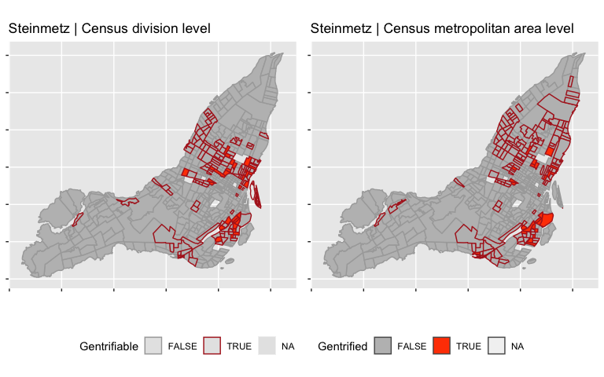
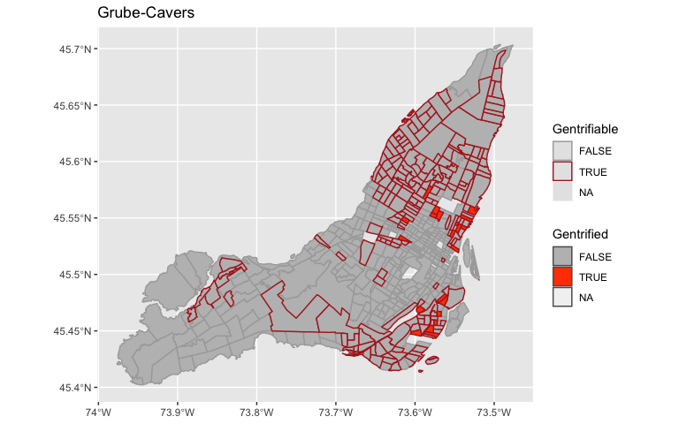
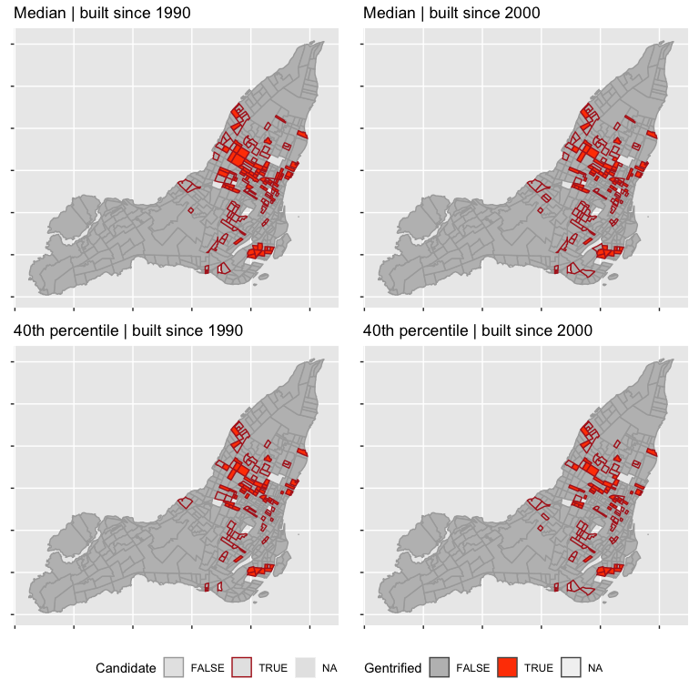
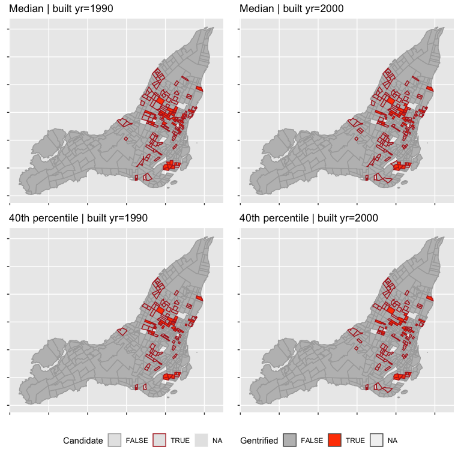
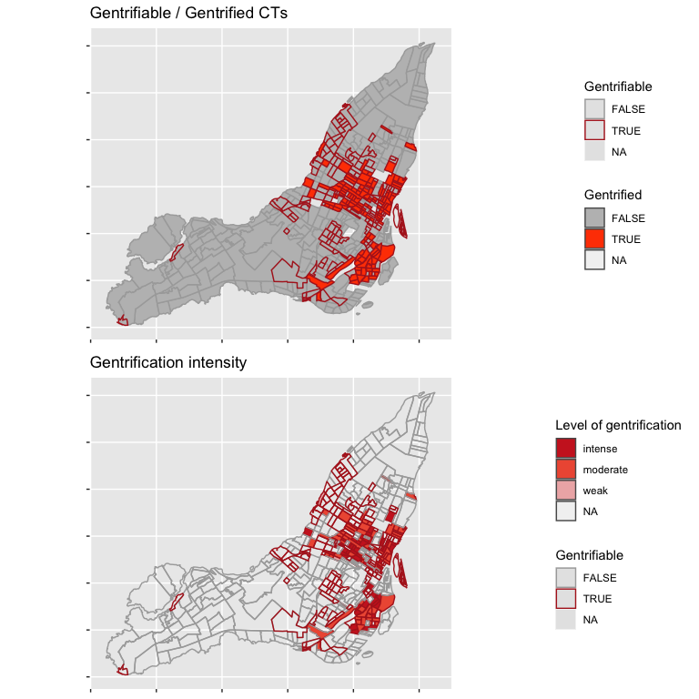

```
## Linking to GEOS 3.7.2, GDAL 2.4.2, PROJ 5.2.0
```

```
## 
## ********************************************************
```

```
## Note: As of version 1.0.0, cowplot does not change the
```

```
##   default ggplot2 theme anymore. To recover the previous
```

```
##   behavior, execute:
##   theme_set(theme_cowplot())
```

```
## ********************************************************
```

```
## 
## Attaching package: 'janitor'
```

```
## The following objects are masked from 'package:stats':
## 
##     chisq.test, fisher.test
```

```
## Loading required package: lattice
```

```
## Loading required package: survival
```

```
## Loading required package: Formula
```

```
## 
## Attaching package: 'Hmisc'
```

```
## The following objects are masked from 'package:dplyr':
## 
##     src, summarize
```

```
## The following objects are masked from 'package:base':
## 
##     format.pval, units
```

```
## Census data is currently stored temporarily.
## 
##  In order to speed up performance, reduce API quota usage, and reduce unnecessary network calls, please set up a persistent cache directory by setting options(cancensus.cache_path = '<path to cancensus cache directory>')
## 
##  You may add this option, together with your API key, to your .Rprofile.
```

```
## Querying CensusMapper API for regions data...
```

```
## Reading regions list from local cache.
```

```
## Reading vectors data from local cache.
```

```
## Reading geo data from local cache.
```

```
## Reading vectors data from local cache.
```

```
## Reading geo data from local cache.
```

```
## Reading vectors data from local cache.
## Reading vectors data from local cache.
## Reading vectors data from local cache.
```

```
## `summarise()` regrouping output by 'CT_UID.2016' (override with `.groups` argument)
```

```
## `summarise()` ungrouping output (override with `.groups` argument)
```

## Metric definitions

In all metrics below, we are using census data from 2006 and 2016.

### Steinmetz-Wood, M., Wasfi, R., _et al._, 2017

Ref: [DOI 10.1186/s12942-017-0096-6](https://ij-healthgeographics.biomedcentral.com/articles/10.1186/s12942-017-0096-6)

Original paper is using CMA level Z-score. Census division (_i.e._ municipality) Z-score added for comparison purposes with Freeman and Ding who work at this scale. Moreover, census years considered were 1996 and 2006.


```r
# ---
# Steinmtez-Wood, M., Wasfi, R. et al. 2017. Is gentrification all bad? ####
# Positive association between gentrification and individual’s perceived neighborhood collective efficacy in Montreal, Canada
# Int J Health Geogr 16:24, 178–194. https://ij-healthgeographics.biomedcentral.com/articles/10.1186/s12942-017-0096-6
# ---
# Indicators used to identify gentrifying tracts included: 
# median household income, proportion of the population with 
# a bachelor’s degree, average rent, proportion of the 
# population with low income, and proportion of the population 
# aged 30–44. Z scores for each measure in 1996 and 2006 were 
# calculated using the Montreal census metropolitan area average
# and standard deviation
#
# Potential to undergo gentrification:
#   negative Z scores in 1996 for median household income, 
#   proportion of the population with a bachelor’s degree, 
#   and average rent and had a positive Z score for the 
#   proportion of population with low income.
# Gentrified:
#   difference between the 2006 and 1996 Z scores was positive 
#   for all indicators except for the proportion of low income, 
#   which needed to be negative

# Define weighted scale function
wtd.scale <- function(x, w) {
  (x - wtd.mean(x, w)) / sqrt(wtd.var(x, w))
}

#
# Main routine to compute Rania's gentrification metric at one specific aggregation level
#
compute_rania_metric <- function(census_data_16, census_data_06, agg_level) {
  agg_level <- enquo(agg_level)

  # Extract Census 2016 variables for Rania's measures
  gentrif_rania16 <- census_data_16 %>% 
    select(GeoUID, CMA_UID, CD_UID, CCS_UID, CSD_UID, `Region Name`, Population,
           starts_with("v_CA16_5051"),starts_with("v_CA16_5078"), #education
           starts_with("v_CA16_1"),starts_with("v_CA16_118"), starts_with("v_CA16_136"),starts_with("v_CA16_154"), #age
           starts_with("v_CA16_4836"),starts_with("v_CA16_4837"),starts_with("v_CA16_4897"),starts_with("v_CA16_4901"), #housing
           starts_with("v_CA16_2396"),starts_with("v_CA16_2397"),starts_with("v_CA16_2398"),starts_with("v_CA16_2510"),starts_with("v_CA16_2570")) #income
  
  # Compute derived variables for 2016
  # ---
  # New variables:
  # - propbach15_2016: proportion of high educ attainment in 2016 (%)
  # - propage30_44_2016: proportion of population aged 30-44 yrs in 2016 (%)
  gentrif_rania16 <- gentrif_rania16 %>% 
    mutate(propbach15_2016 = `v_CA16_5078: University certificate, diploma or degree at bachelor level or above` / `v_CA16_5051: Total - Highest certificate, diploma or degree for the population aged 15 years and over in private households - 25% sample data` * 100) %>%
    mutate(propage30_44_2016 = (`v_CA16_118: 30 to 34 years` + `v_CA16_136: 35 to 39 years` + `v_CA16_154: 40 to 44 years`) / `v_CA16_1: Age Stats` * 100) %>%
    filter(!is.na(CD_UID))
  
  # Extract Census 2006 variables
  gentrif_rania06 <- census_data_06 %>% 
    select(GeoUID, CMA_UID, CD_UID, CCS_UID, CSD_UID, `Region Name`, Population,
           starts_with("v_CA06_1234"),starts_with("v_CA06_1240"),starts_with("v_CA06_1248"),starts_with("v_CA06_1254"),starts_with("v_CA06_1262"),starts_with("v_CA06_1268"), #education
           starts_with("v_CA06_2"),starts_with("v_CA06_10"),starts_with("v_CA06_11"),starts_with("v_CA06_12"),starts_with("v_CA06_29"),starts_with("v_CA06_30"),starts_with("v_CA06_31"), #age
           starts_with("v_CA06_101"),starts_with("v_CA06_102"),starts_with("v_CA06_2049"),starts_with("v_CA06_2050"), #housing
           starts_with("v_CA06_1988"),starts_with("v_CA06_2000"),starts_with("v_CA06_1979"),starts_with("v_CA06_1981")) %>% #income
    filter(!is.na(CD_UID))
  # Compute derived variables for 2006
  # ---
  # New variables:
  # - propbach15_2006: proportion of high educ attainment in 2006 (%)
  # - propage30_44_2006: proportion of population aged 30-44 yrs in 2006 (%)
  gentrif_rania06 <- gentrif_rania06 %>% 
    mutate(propbach15_2006 = (`v_CA06_1240: University certificate, diploma or degree` + 
                                `v_CA06_1254: University certificate, diploma or degree` + 
                                `v_CA06_1268: University certificate, diploma or degree`) / 
             (`v_CA06_1234: Total population 15 to 24 years by highest certificate, diploma or degree - 20% sample data` + 
                `v_CA06_1248: Total population 25 to 64 years by highest certificate, diploma or degree - 20% sample data` + 
                `v_CA06_1262: Total population 65 years and over by highest certificate, diploma or degree - 20% sample data`) * 100) %>%
    mutate(propage30_44_2006 = (`v_CA06_29: 30 to 34 years` + `v_CA06_10: 30 to 34 years` + `v_CA06_11: 35 to 39 years` + `v_CA06_30: 35 to 39 years` + `v_CA06_12: 40 to 44 years` + `v_CA06_31: 40 to 44 years`) / `v_CA06_2: Total population by sex and age groups - 100% data` * 100)
  
  # Compute zscores at the specified aggregation level
  # ---
  # New variables:
  # - propbach15_2016z: z-score of proportion of high educ attainment in 2016, ref level = census division or census metropolitan area
  # - propage30_44_2016z: z-score of proportion of population aged 30-44 yrs in 2016, ref level = census division or census metropolitan area
  # - incmedhous_2016z: z-score of median household income in 2016, ref level = census division or census metropolitan area
  # - proplowinc_2016z: z-score of prrevalence of low income in 2016, ref level = census division or census metropolitan area
  # - avgrent_2016z: z-score of average monthly renting costs in 2016, ref level = census division or census metropolitan area
  gentrif_rania16 <- gentrif_rania16 %>% 
    group_by(!!agg_level) %>%
    mutate(propbach15_2016z = wtd.scale(propbach15_2016, `v_CA16_5051: Total - Highest certificate, diploma or degree for the population aged 15 years and over in private households - 25% sample data`)) %>%
    mutate(propage30_44_2016z = wtd.scale(propage30_44_2016, `v_CA16_1: Age Stats`)) %>%
    mutate(incmedhous_2016z = wtd.scale(`v_CA16_2397: Median total income of households in 2015 ($)`, `v_CA16_2396: Total - Income statistics in 2015 for private households by household size - 100% data`)) %>%
    mutate(proplowinc_2016z = wtd.scale(`v_CA16_2570: Prevalence of low income based on the Low-income cut-offs, after tax (LICO-AT) (%)`, `v_CA16_2510: Total - Low-income status in 2015 for the population in private households to whom low-income concepts are applicable - 100% data`)) %>%
    mutate(avgrent_2016z = wtd.scale(`v_CA16_4901: Average monthly shelter costs for rented dwellings ($)`, `v_CA16_4897: Total - Tenant households in non-farm, non-reserve private dwellings - 25% sample data`)) %>%
    ungroup() %>%
    filter(!is.na(!!agg_level))
  
  # Compute zscores at the Census Division level
  # ---
  # New variables:
  # - propbach15_2006z: z-score of proportion of high educ attainment in 2006, ref level = census division or census metropolitan area
  # - propage30_44_2006z: z-score of proportion of population aged 30-44 yrs in 2006, ref level = census division or census metropolitan area
  # - incmedhous_2006z: z-score of median household income in 2006, ref level = census division or census metropolitan area
  # - proplowinc_2006z: z-score of prrevalence of low income in 2006, ref level = census division or census metropolitan area
  # - avgrent_2006z: z-score of average monthly renting costs in 2006, ref level = census division or census metropolitan area
  gentrif_rania06 <- gentrif_rania06 %>% 
    group_by(!!agg_level) %>%
    mutate(propbach15_2006z = wtd.scale(propbach15_2006, `v_CA06_1234: Total population 15 to 24 years by highest certificate, diploma or degree - 20% sample data` + 
                                          `v_CA06_1248: Total population 25 to 64 years by highest certificate, diploma or degree - 20% sample data` + 
                                          `v_CA06_1262: Total population 65 years and over by highest certificate, diploma or degree - 20% sample data`)) %>%
    mutate(propage30_44_2006z = wtd.scale(propage30_44_2006, `v_CA06_2: Total population by sex and age groups - 100% data`)) %>%
    mutate(incmedhous_2006z = wtd.scale(`v_CA06_2000: Median household income $`, `v_CA06_1988: Household income in 2005 of private households - 20% sample data`)) %>%
    mutate(proplowinc_2006z = wtd.scale(`v_CA06_1981: Prevalence of low income after tax in 2005 %`, `v_CA06_1979: Total persons in private households - 20% sample data`)) %>%
    mutate(avgrent_2006z = wtd.scale(`v_CA06_2050: Average gross rent $`, `v_CA06_2049: Tenant-occupied private non-farm, non-reserve dwellings`)) %>%
    ungroup() %>%
    filter(!is.na(!!agg_level))
  
  # Merge and cleanup function:
  # ---
  # New variables:
  # - propbach15diff: difference between 2006 and 2016 in higher educ attainment
  # - propage30_44diff: difference between 2006 and 2016 in population aged 30-44 yrs
  # - incmedhousdiff: difference between 2006 and 2016 in household income
  # - proplowincdiff: difference between 2006 and 2016 in prevalence of low income
  # - avgrentdiff: difference between 2006 and 2016 in average renting costs
  # - potentially_gentrifying: candidate CTs to gentrification in 2006
  # - gentrified: actually gentrified CTs in 2016
  .gentrif_rania06_nogeom <- gentrif_rania06 %>%
    select(GeoUID, Population, ends_with("z"))
  st_geometry(.gentrif_rania06_nogeom) <- NULL
  
  return (gentrif_rania16 %>%
            select(GeoUID, CMA_UID, CD_UID, CCS_UID, CSD_UID, `Region Name`, Population, ends_with("z")) %>%
            left_join(lut_ct2016_2006, by=c("GeoUID" = "CT_UID.2016")) %>%
            left_join(.gentrif_rania06_nogeom, by=c("CT_UID.2006" = "GeoUID"), suffix=c("2016", "2006")) %>%
            select(-CT_UID.2006) %>%
            # Compute differences between 2006 and 2016
            mutate(propbach15diff = propbach15_2016z - propbach15_2006z) %>%
            mutate(propage30_44diff = propage30_44_2016z - propage30_44_2006z) %>%
            mutate(incmedhousdiff = incmedhous_2016z - incmedhous_2006z) %>%
            mutate(proplowincdiff = proplowinc_2016z - proplowinc_2006z) %>%
            mutate(avgrentdiff = avgrent_2016z - avgrent_2006z) %>%
            # Flag potentially gentrifying CTs in 2006
            mutate(potentially_gentrifying = incmedhous_2006z < 0 & propbach15_2006z < 0 & avgrent_2006z < 0 & proplowinc_2006z > 0) %>%
            #Flag actually gentrified CTs in 2016
            mutate(gentrified = potentially_gentrifying &
                     incmedhousdiff > 0 & propbach15diff > 0 & avgrentdiff > 0 & propage30_44diff > 0 & proplowincdiff < 0)
  )
}

# Compute Rania's metrics for all three levels CMS | CD | CCS
gentrif_rania06_16_CD <- compute_rania_metric(census_data_16, census_data_06, CD_UID)
gentrif_rania06_16_CCS <- compute_rania_metric(census_data_16, census_data_06, CCS_UID)
gentrif_rania06_16_CMA <- compute_rania_metric(census_data_16, census_data_06, CMA_UID)
```

<!-- -->

#### Statistics {.tabset}

##### CMA level


```
## `summarise()` ungrouping output (override with `.groups` argument)
```


Table: Gentrifiable CTs, using the CMA level | Montréal Island

potentially_gentrifying    n_CTs   pop_2016   n_CTs %   pop_2016 %
------------------------  ------  ---------  --------  -----------
FALSE                        372    1371303      69.8         70.6
TRUE                         147     563497      27.6         29.0
NA                            14       7244       2.6          0.4

```
## `summarise()` ungrouping output (override with `.groups` argument)
```


Table: Gentrified CTs, using the CMA level | Montréal Island

gentrified    n_CTs   pop_2016   n_CTs %   pop_2016 %
-----------  ------  ---------  --------  -----------
FALSE           496    1866730      93.1         96.1
TRUE             24      71016       4.5          3.7
NA               13       4298       2.4          0.2

##### CD level


```
## `summarise()` ungrouping output (override with `.groups` argument)
```


Table: Gentrifiable CTs, using the CD level | Montréal Island

potentially_gentrifying    n_CTs   pop_2016   n_CTs %   pop_2016 %
------------------------  ------  ---------  --------  -----------
FALSE                        385    1441239      72.2         74.2
TRUE                         134     493561      25.1         25.4
NA                            14       7244       2.6          0.4

```
## `summarise()` ungrouping output (override with `.groups` argument)
```


Table: Gentrified CTs, using the CD level | Montréal Island

gentrified    n_CTs   pop_2016   n_CTs %   pop_2016 %
-----------  ------  ---------  --------  -----------
FALSE           491    1835305      92.1         94.5
TRUE             30     104862       5.6          5.4
NA               12       1877       2.3          0.1

### Grube-Cavers, A., Patterson, Z. 2015

Ref: [DOI 10.1177/0042098014524287](https://journals.sagepub.com/doi/10.1177/0042098014524287)

Here again, CTs are compared to CMA average and census years were 1996 and 2006.


```r
# ---
# Grube-Cavers, A., Patterson, Z., 2015. Urban rapid rail transit and gentrification in Canadian urban centres ####
# A survival analysis approach. 
# Urban Stud. 52, 178–194. https://doi.org/10.1177/0042098014524287
# ---
# NB: Adaptation of some variables, which no longer exist in 2016 (professional occupation)
# and number of degrees (~highest education level)
# NB: Grube-Cavers compares to CMA (like Rania) instead of CD (as Ding and Freeman do)
# ---
# Gentrifiable:
#   - average family income and number of degrees per capita lower than the CMA average
# Gentrified: all indicators below have to have experienced an improvement in the CT greater than the 
#   average change experienced in those indicators for the CMA
#   - average monthly rent;
#   - proportion of people in professional occupations;
#   - percentage of owner-occupied dwellings;
#   - average family income;
#   - number of degrees per capita

#
# Main routine to compute Grube-Caver's gentrification metric at one specific aggregation level
#
compute_grube_metric <- function(census_data_16, census_data_06, agg_level) {
  agg_level <- enquo(agg_level)
  
  # Extract Census 2016 variables for Grube-Cavers' measures
  gentrif_grube16 <- census_data_16 %>% 
    select(GeoUID, CMA_UID, CD_UID, CCS_UID, CSD_UID, `Region Name`, Population,
           starts_with("v_CA16_5051"),starts_with("v_CA16_5078"), #education
           starts_with("v_CA16_4836"),starts_with("v_CA16_4837"),starts_with("v_CA16_4897"),starts_with("v_CA16_4901"), #housing
           starts_with("v_CA16_4993"),starts_with("v_CA16_4994"), #income
           starts_with("v_CA16_5693"),starts_with("v_CA16_5735")) %>% #professional occupation
    mutate(`v_CA16_4901: Average monthly shelter costs for rented dwellings ($)` = na_if(`v_CA16_4901: Average monthly shelter costs for rented dwellings ($)`, 0)) #set 0$ rent to NA
  
  # Compute derived variables for 2016
  # ---
  # New variables:
  # - propbach15_2016: proportion of high educ attainment in 2016 (%)
  # - propprof_2016: proportion of people in professional occupations in 2016 (%)
  # - propowner_2016: percentage of owner-occupied dwellings in 2016 (%)
  gentrif_grube16 <- gentrif_grube16 %>% 
    mutate(propbach15_2016 = `v_CA16_5078: University certificate, diploma or degree at bachelor level or above` / `v_CA16_5051: Total - Highest certificate, diploma or degree for the population aged 15 years and over in private households - 25% sample data` * 100,
           propprof_2016 = `v_CA16_5735: 54 Professional, scientific and technical services` / `v_CA16_5693: Total Labour Force population aged 15 years and over by Industry - North American Industry Classification System (NAICS) 2012 - 25% sample data` * 100,
           propowner_2016 = `v_CA16_4837: Owner` / `v_CA16_4836: Total - Private households by tenure - 25% sample data` * 100) %>%
    filter(!is.na(!!agg_level))
  
  # Extract Census 2006 variables
  gentrif_grube06 <- census_data_06 %>% 
    select(GeoUID, CMA_UID, CD_UID, CCS_UID, CSD_UID, `Region Name`, Population,
           starts_with("v_CA06_1234"),starts_with("v_CA06_1240"),starts_with("v_CA06_1248"),starts_with("v_CA06_1254"),starts_with("v_CA06_1262"),starts_with("v_CA06_1268"), #education
           starts_with("v_CA06_101"),starts_with("v_CA06_102"),starts_with("v_CA06_2049"),starts_with("v_CA06_2050"), #housing
           starts_with("v_CA06_1729"),starts_with("v_CA06_1742"), #income
           starts_with("v_CA06_1007"), starts_with("v_CA06_1021")) %>% #occupation
    mutate(`v_CA06_2050: Average gross rent $` = na_if(`v_CA06_2050: Average gross rent $`, 0)) %>% #set 0$ rent to NA
    filter(!is.na(!!agg_level))
  
  # Compute derived variables for 2006
  # ---
  # New variables:
  # - propbach15_2006: proportion of high educ attainment in 2006 (%)
  # - propprof_2006: proportion of people in professional occupations in 2006 (%)
  # - propowner_2006: percentage of owner-occupied dwellings in 2006 (%)
  # - famincome_2006_mean: CMA average of average family income
  # - propbach15_2006_mean: CMA average of proportion of high educ attainment
  gentrif_grube06 <- gentrif_grube06 %>% 
    mutate(propbach15_2006 = (`v_CA06_1240: University certificate, diploma or degree` + 
                                `v_CA06_1254: University certificate, diploma or degree` + 
                                `v_CA06_1268: University certificate, diploma or degree`) / 
             (`v_CA06_1234: Total population 15 to 24 years by highest certificate, diploma or degree - 20% sample data` + 
                `v_CA06_1248: Total population 25 to 64 years by highest certificate, diploma or degree - 20% sample data` + 
                `v_CA06_1262: Total population 65 years and over by highest certificate, diploma or degree - 20% sample data`) * 100,
           propprof_2006 = `v_CA06_1021: 54 Professional, scientific and technical services` / `v_CA06_1007: Total labour force 15 years and over by industry - North American Industry Classification System 2002  - 20% sample data` * 100,
           propowner_2006 = `v_CA06_102: Owned` / `v_CA06_101: Total number of occupied private dwellings by housing tenure - 20% sample data` * 100) %>%
    group_by(!!agg_level) %>%
    mutate(famincome_2006_mean = wtd.mean(`v_CA06_1742: Average family income $`, 
                                          `v_CA06_1729: Family income in 2005 of economic families - 20% sample data`, na.rm = TRUE),
           propbach15_2006_mean = wtd.mean(propbach15_2006, 
                                           `v_CA06_1234: Total population 15 to 24 years by highest certificate, diploma or degree - 20% sample data` + 
                                             `v_CA06_1248: Total population 25 to 64 years by highest certificate, diploma or degree - 20% sample data` + 
                                             `v_CA06_1262: Total population 65 years and over by highest certificate, diploma or degree - 20% sample data` , na.rm = TRUE)) %>%
    ungroup()
  
  # Join Census 2006 to 2016 and compute differences, etc.
  # ---
  # New variables:
  # - propbach15_change: change in proportion of high educ attainment (propbach15_2016 - propbach15_2006)
  # - propprof_change: change in proportion of people in professional occupations (propprof_2016 - propprof_2006)
  # - propowner_change: change in percentage of owner-occupied dwellings (propowner_2016 - propowner_2006)
  # - famincome_change: change in average family income between 2006 and 2016
  # - avgrent_change: change in average monthly rent between 2006 and 2016
  .gentrif_grube06_nogeom <- gentrif_grube06 %>%
    select(GeoUID, Population, starts_with("v_CA06_1742"), starts_with("v_CA06_2050"), 
           propbach15_2006, propprof_2006, propowner_2006, famincome_2006_mean, propbach15_2006_mean)
  st_geometry(.gentrif_grube06_nogeom) <- NULL
  
  gentrif_grube06_16 <- gentrif_grube16 %>%
    select(GeoUID, Population, CMA_UID, CD_UID, CCS_UID, CSD_UID, `Region Name`,
           starts_with("v_CA16_4897"), starts_with("v_CA16_4901"), 
           starts_with("v_CA16_4993"), starts_with("v_CA16_4994"),
           starts_with("v_CA16_5051"), propbach15_2016,
           starts_with("v_CA16_5693"), propprof_2016, 
           starts_with("v_CA16_4836"), propowner_2016) %>%
    left_join(lut_ct2016_2006, by=c("GeoUID" = "CT_UID.2016")) %>%
    left_join(.gentrif_grube06_nogeom, by=c("CT_UID.2006" = "GeoUID"), suffix=c("2016", "2006")) %>%
    select(-CT_UID.2006) %>%
    mutate(propbach15_change = propbach15_2016 - propbach15_2006,
           propprof_change = propprof_2016 - propprof_2006,
           propowner_change = propowner_2016 - propowner_2006,
           famincome_change = (`v_CA16_4994: Average total income of economic families in 2015 ($)` - `v_CA06_1742: Average family income $`) / 
             `v_CA06_1742: Average family income $` * 100,
           avgrent_change = (`v_CA16_4901: Average monthly shelter costs for rented dwellings ($)` - `v_CA06_2050: Average gross rent $`) / 
             `v_CA06_2050: Average gross rent $` * 100) %>%
    group_by(!!agg_level) %>%
    mutate(propbach15_change_mean = wtd.mean(propbach15_change, 
                                             `v_CA16_5051: Total - Highest certificate, diploma or degree for the population aged 15 years and over in private households - 25% sample data`, na.rm = TRUE),
           propprof_change_mean = wtd.mean(propprof_change,
                                           `v_CA16_5693: Total Labour Force population aged 15 years and over by Industry - North American Industry Classification System (NAICS) 2012 - 25% sample data`, na.rm = TRUE),
           propowner_change_mean = wtd.mean(propowner_change,
                                            `v_CA16_4836: Total - Private households by tenure - 25% sample data`, na.rm = TRUE),
           famincome_change_mean = wtd.mean(famincome_change,
                                            `v_CA16_4993: Total - Income statistics in 2015 for economic families in private households - 25% sample data`, na.rm = TRUE),
           avgrent_change_mean = wtd.mean(avgrent_change,
                                          `v_CA16_4897: Total - Tenant households in non-farm, non-reserve private dwellings - 25% sample data`, na.rm = TRUE)) %>%
    ungroup()
  
  rm(.gentrif_grube06_nogeom) #cleanup
  
  # Flag gentrifiable and gentrified CTs
  # ---
  # New variables:
  # - gentrifiable: CTs candidate to gentrification in 2006
  # - gentrified: CTs catually gentrified in 2016
  return(gentrif_grube06_16 %>%
    mutate(gentrifiable = `v_CA06_1742: Average family income $` < famincome_2006_mean & propbach15_2006 < propbach15_2006_mean,
           gentrified = gentrifiable & 
             propbach15_change > propbach15_change_mean &
             propprof_change > propprof_change_mean &
             propowner_change > propowner_change_mean &
             famincome_change > famincome_change_mean &
             avgrent_change > avgrent_change_mean)
  )
}

# Compute Grube-Caver's metrics for all three levels CMA | CD | CCS
gentrif_grube06_16_CMA <- compute_grube_metric(census_data_16, census_data_06, CMA_UID)
gentrif_grube06_16_CD <- compute_grube_metric(census_data_16, census_data_06, CD_UID)
gentrif_grube06_16_CCS <- compute_grube_metric(census_data_16, census_data_06, CCS_UID)
```

<!-- -->

```
## `summarise()` ungrouping output (override with `.groups` argument)
```


Table: Gentrifiable CTs | Montréal Island

gentrifiable    n_CTs   pop_2016   n_CTs %   pop_2016 %
-------------  ------  ---------  --------  -----------
FALSE             316    1138446      59.3         58.6
TRUE              203     796354      38.1         41.0
NA                 14       7244       2.6          0.4

```
## `summarise()` ungrouping output (override with `.groups` argument)
```


Table: Gentrified CTs | Montréal Island

gentrified    n_CTs   pop_2016   n_CTs %   pop_2016 %
-----------  ------  ---------  --------  -----------
FALSE           498    1870091      93.4         96.3
TRUE             21      64709       3.9          3.3
NA               14       7244       2.6          0.4

### Freeman, L., 2005

Ref: [DOI: 10.1177/1078087404273341](https://journals.sagepub.com/doi/10.1177/1078087404273341)

Freeman' gentrification metrics applies at the municiplaty level, which in Canada corresponds to the Census Subdivision [(CSD)](https://www12.statcan.gc.ca/census-recensement/2016/ref/dict/geo012-eng.cfm). Yet, this level may not properly capture the phenomenon at a larger scale, hence the implementation of the metric in a Canadian context is rather based on Census Division [(CD)](https://www12.statcan.gc.ca/census-recensement/2016/ref/dict/geo008-eng.cfm) and Census Consolidated Subdivision [(CCS)](https://www12.statcan.gc.ca/census-recensement/2016/ref/dict/geo007-eng.cfm).

Freeman is using two thresholds to select gentrifiable CTs: one is comparing CT variables to municipality median while the second is using the 40th percentile instead. Moreover, reinvestment is measured by the proportion of housing built within the past 20 years. Yet, Canadian censuses give us either numbers for the past 15 years or 25 years.  
All for combinations at the CD level are presented below (For Montreal, CD and CCS match).


```r
# ---
# Freeman, L., 2005. Displacement or Succession?: Residential Mobility in Gentrifying Neighborhoods. ####
# Urban Aff. Rev. 40, 463–491.
# ---
# Criteria:
# 1. Be located in the central city at the beginning of the intercensal period.
# 2. Have a median income less than the median (40th percentile) for that metropolitan
# area at the beginning of the intercensal period.
# 3. Have a proportion of housing built within the past 20 years lower than the proportion
# found at the median (40th percentile) for the respective metropolitan area.
# 4. Have a percentage increase in educational attainment greater than the median
# increase in educational attainment for that metropolitan area.
# 5. Have an increase in real housing prices during the intercensal period.
# ---

#
# Main routine to compute Freeman's gentrification metric at one specific aggregation level
#
compute_freeman_metric <- function(census_data_16, census_data_06, agg_level) {
  agg_level <- enquo(agg_level)
  
  # Extract census variables for Freeman's measures
  gentrif_freeman16 <- census_data_16  %>% 
    select(GeoUID, CMA_UID, CD_UID, CCS_UID, CSD_UID, `Region Name`, Population,
           starts_with("v_CA16_5051"),starts_with("v_CA16_5078"), #education
           starts_with("v_CA16_4862"),starts_with("v_CA16_4866"),starts_with("v_CA16_4867"),starts_with("v_CA16_4868"),starts_with("v_CA16_4869"), #construction year
           starts_with("v_CA16_4890"), starts_with("v_CA16_4895"),starts_with("v_CA16_4896")) #housing prices
  
  gentrif_freeman06 <- census_data_06 %>%
    select(GeoUID, CMA_UID, CD_UID, CCS_UID, CSD_UID, `Region Name`, Population,
           starts_with("v_CA06_1234"),starts_with("v_CA06_1240"),starts_with("v_CA06_1248"),starts_with("v_CA06_1254"),starts_with("v_CA06_1262"),starts_with("v_CA06_1268"), #education
           starts_with("v_CA06_1988"),starts_with("v_CA06_2000"), #income
           starts_with("v_CA06_2053"),starts_with("v_CA06_2054")) #housing prices
  
  # Compute status of CT compared to median of income and construction year variables
  # ---
  # New variables:
  # - pct_built_after_2000: proportion of private dwellings built from 2001 to 2016 (%)
  # - pct_built_after_1990: proportion of private dwellings built from 1991 to 2016 (%)
  # - pct_built_after_2000_median: median of the proportion of private dwellings built from 2001 to 2016 at the Census Division level (%)
  # - pct_built_after_1990_median: median of the proportion of private dwellings built from 1991 to 2016 at the Census Division level (%)
  # - pct_built_after_2000_40thpctile: 40th percentile of the proportion of private dwellings built from 2001 to 2016 at the Census Division level (%)
  # - pct_built_after_1990_40thpctile: 40th percentile of the proportion of private dwellings built from 1991 to 2016 at the Census Division level (%)
  # - pct_educ_attainment2016: proportion of university degrees in 2016 among population aged 15yrs and over (%)
  # - pct_educ_attainment2006: proportion of university degrees in 2006 among population aged 15yrs and over (%)
  # - med_household_income2006_median: median of the median household income in 2006 at the Census Division level ($)
  # - med_household_income2006_40thpctile: 40th percentile of the median household income in 2006 at the Census Division level ($)
  gentrif_freeman16 <- gentrif_freeman16 %>%
    mutate(pct_built_after_2000 = (`v_CA16_4867: 2001 to 2005` + `v_CA16_4868: 2006 to 2010` + `v_CA16_4869: 2011 to 2016`) / `v_CA16_4862: Total - Occupied private dwellings by period of construction - 25% sample data` * 100,
           pct_built_after_1990 = (`v_CA16_4866: 1991 to 2000` + `v_CA16_4867: 2001 to 2005` + `v_CA16_4868: 2006 to 2010` + `v_CA16_4869: 2011 to 2016`) / `v_CA16_4862: Total - Occupied private dwellings by period of construction - 25% sample data` * 100,
           pct_educ_attainment2016 = `v_CA16_5078: University certificate, diploma or degree at bachelor level or above` / `v_CA16_5051: Total - Highest certificate, diploma or degree for the population aged 15 years and over in private households - 25% sample data` * 100) %>%
    group_by(!!agg_level) %>%
    mutate(pct_built_after_2000_median = wtd.quantile(pct_built_after_2000,
                                                      `v_CA16_4862: Total - Occupied private dwellings by period of construction - 25% sample data`,
                                                      probs = c(.5), na.rm = TRUE),
           pct_built_after_2000_40thpctile = wtd.quantile(pct_built_after_2000, 
                                                          `v_CA16_4862: Total - Occupied private dwellings by period of construction - 25% sample data`,
                                                          probs = c(.4), na.rm = TRUE),
           pct_built_after_1990_median = wtd.quantile(pct_built_after_1990,
                                                      `v_CA16_4862: Total - Occupied private dwellings by period of construction - 25% sample data`,
                                                      probs = c(.5), na.rm = TRUE),
           pct_built_after_1990_40thpctile = wtd.quantile(pct_built_after_1990, 
                                                          `v_CA16_4862: Total - Occupied private dwellings by period of construction - 25% sample data`,
                                                          probs = c(.4), na.rm = TRUE)) %>%
    ungroup()
  
  gentrif_freeman06 <- gentrif_freeman06 %>%
    group_by(!!agg_level) %>%
    mutate(pct_educ_attainment2006 = (`v_CA06_1240: University certificate, diploma or degree` + 
                                        `v_CA06_1254: University certificate, diploma or degree` + 
                                        `v_CA06_1268: University certificate, diploma or degree`) / 
             (`v_CA06_1234: Total population 15 to 24 years by highest certificate, diploma or degree - 20% sample data` + 
                `v_CA06_1248: Total population 25 to 64 years by highest certificate, diploma or degree - 20% sample data` + 
                `v_CA06_1262: Total population 65 years and over by highest certificate, diploma or degree - 20% sample data`) * 100) %>%
    mutate(sum_non_NA = sum(!is.na(`v_CA06_2000: Median household income $`)), # add condition to avoid error while computing the weighted median for CD with no non NA value
           med_household_income2006_median = ifelse(sum_non_NA != 0,
                                                    wtd.quantile(`v_CA06_2000: Median household income $`, 
                                                                 `v_CA06_1988: Household income in 2005 of private households - 20% sample data`,
                                                                 probs = c(.5), na.rm = TRUE),
                                                    NA),
           med_household_income2006_40thpctile = ifelse(sum_non_NA != 0,
                                                        wtd.quantile(`v_CA06_2000: Median household income $`,
                                                                     `v_CA06_1988: Household income in 2005 of private households - 20% sample data`,
                                                                     probs = c(.4), na.rm = TRUE),
                                                        NA)) %>%
    ungroup() %>%
    select(-sum_non_NA)
  
  # Join Census 2006 to 2016 and compute differences, etc.
  # ---
  # New variables:
  # - pct_educ_attainment_change: increase in educational attainment (pct_educ_attainment2016 - pct_educ_attainment2006)
  # - pct_house_value_change: increase in house values (in $ 2006 and $ 2016 respectively)
  # - pct_educ_attainment_change_median: median of the increase in educational attainment between 2006 and 2016 at the Census Division level
  # - pct_house_value_change_median: median of the house value between 2006 and 2016 at the Census Division level
  .gentrif_freeman06_nogeom <- gentrif_freeman06 %>%
    select(GeoUID, Population, starts_with("v_CA06_2054"), starts_with("v_CA06_2000"), 
           pct_educ_attainment2006, med_household_income2006_median, med_household_income2006_40thpctile)
  st_geometry(.gentrif_freeman06_nogeom) <- NULL
  
  gentrif_freeman06_16 <- gentrif_freeman16 %>%
    select(GeoUID, Population, CMA_UID, CD_UID, CCS_UID, CSD_UID, `Region Name`,
          starts_with("v_CA16_4890"), starts_with("v_CA16_4896"),
           starts_with("v_CA16_5051"), pct_educ_attainment2016, 
          starts_with("v_CA16_4862"), pct_built_after_1990, pct_built_after_1990_median, pct_built_after_1990_40thpctile,
           pct_built_after_2000, pct_built_after_2000_median, pct_built_after_2000_40thpctile) %>%
    left_join(lut_ct2016_2006, by=c("GeoUID" = "CT_UID.2016")) %>%
    left_join(.gentrif_freeman06_nogeom, by=c("CT_UID.2006" = "GeoUID"), suffix=c("2016", "2006")) %>%
    select(-CT_UID.2006) %>%
    mutate(pct_educ_attainment_change = pct_educ_attainment2016 - pct_educ_attainment2006,
           pct_house_value_change = (`v_CA16_4896: Average value of dwellings ($)` - `v_CA06_2054: Average value of dwelling $`) / 
             `v_CA06_2054: Average value of dwelling $` * 100) %>%
    group_by(!!agg_level) %>%
    mutate(sum_non_NA1 = sum(!is.na(pct_educ_attainment_change)), # add condition to avoid error while computing the weighted median for CD with no non NA value
           sum_non_NA2 = sum(!is.na(pct_house_value_change)),
            pct_educ_attainment_change_median = ifelse(sum_non_NA1 != 0,
                                                       wtd.quantile(pct_educ_attainment_change,
                                                            `v_CA16_5051: Total - Highest certificate, diploma or degree for the population aged 15 years and over in private households - 25% sample data`,
                                                            probs = c(.5), na.rm = TRUE),
                                                       NA),
           pct_house_value_change_median = ifelse(sum_non_NA2 != 0,
                                                  wtd.quantile(pct_house_value_change, 
                                                  `v_CA16_4862: Total - Occupied private dwellings by period of construction - 25% sample data`,
                                                  probs = c(.5), na.rm = TRUE),
                                                  NA)) %>%
    ungroup() %>%
    select(-starts_with("sum_non_NA"))
  
  rm(.gentrif_freeman06_nogeom) #cleanup
  
  # Flag candidate CTs
  # NB. Condition 1. (CT in central city not considered here)
  # ---
  # New variables:
  # - candidate_built1990_median: candidate based on conditions 2. and 3., median reference, built year ref = 1990
  # - candidate_built2000_median: candidate based on conditions 2. and 3., median reference, built year ref = 2000
  # - candidate_built1990_40thpctile: candidate based on conditions 2. and 3., 40th percentile reference, built year ref = 1990
  # - candidate_built2000_40thpctile: candidate based on conditions 2. and 3., 40th percentile reference, built year ref = 2000
  gentrif_freeman06_16 <- gentrif_freeman06_16 %>%
    mutate(candidate_built1990_median = `v_CA06_2000: Median household income $` < med_household_income2006_median & pct_built_after_1990 < pct_built_after_1990_median,
           candidate_built2000_median = `v_CA06_2000: Median household income $` < med_household_income2006_median & pct_built_after_2000 < pct_built_after_2000_median,
           candidate_built1990_40thpctile = `v_CA06_2000: Median household income $` < med_household_income2006_median & pct_built_after_1990 < pct_built_after_1990_40thpctile,
           candidate_built2000_40thpctile = `v_CA06_2000: Median household income $` < med_household_income2006_median & pct_built_after_2000 < pct_built_after_2000_40thpctile)
 
  # Flag gentrified CTs (original Freeman's method)
  # ---
  # New variables:
  # - gentrified_built1990_median: gentrified CT based on candidate_built1990_median and conditions 4. and 5.
  # - gentrified_built2000_median: gentrified CT based on candidate_built2000_median and conditions 4. and 5.
  # - gentrified_built1990_40thpctile: gentrified CT based on candidate_built1990_40thpctile and conditions 4. and 5.
  # - gentrified_built1990_40thpctile: gentrified CT based on candidate_built1990_40thpctile and conditions 4. and 5.
  gentrif_freeman06_16 <- gentrif_freeman06_16 %>%
    mutate(gentrified_built1990_median = candidate_built1990_median & pct_educ_attainment_change > pct_educ_attainment_change_median &
             pct_house_value_change > 17.77, #comparing to inflation (17.77%) between 2006 and 2016. See https://www.bankofcanada.ca/rates/related/inflation-calculator/
           gentrified_built2000_median = candidate_built2000_median & pct_educ_attainment_change > pct_educ_attainment_change_median &
             pct_house_value_change > 17.77,
           gentrified_built1990_40thpctile = candidate_built1990_40thpctile & pct_educ_attainment_change > pct_educ_attainment_change_median &
             pct_house_value_change > 17.77,
           gentrified_built2000_40thpctile = candidate_built2000_40thpctile & pct_educ_attainment_change > pct_educ_attainment_change_median &
             pct_house_value_change > 17.77)
  
  # Flag gentrified CTs (tweaked Freeman's method: we no longer compare house value increase to inflation but to
  # median house value increase in each census division, i.e. same as for higher educ attainment condition)
  # ---
  # New variables:
  # - gentrified_built1990_median: gentrified CT based on candidate_built1990_median and conditions 4. and 5.
  # - gentrified_built2000_median: gentrified CT based on candidate_built2000_median and conditions 4. and 5.
  # - gentrified_built1990_40thpctile: gentrified CT based on candidate_built1990_40thpctile and conditions 4. and 5.
  # - gentrified_built1990_40thpctile: gentrified CT based on candidate_built1990_40thpctile and conditions 4. and 5.
  gentrif_freeman06_16 <- gentrif_freeman06_16 %>%
    mutate(gentrified_tweaked_built1990_median = candidate_built1990_median & pct_educ_attainment_change > pct_educ_attainment_change_median &
             pct_house_value_change > pct_house_value_change_median,
           gentrified_tweaked_built2000_median = candidate_built2000_median & pct_educ_attainment_change > pct_educ_attainment_change_median &
             pct_house_value_change > pct_house_value_change_median,
           gentrified_tweaked_built1990_40thpctile = candidate_built1990_40thpctile & pct_educ_attainment_change > pct_educ_attainment_change_median &
             pct_house_value_change > pct_house_value_change_median,
           gentrified_tweaked_built2000_40thpctile = candidate_built2000_40thpctile & pct_educ_attainment_change > pct_educ_attainment_change_median &
             pct_house_value_change > pct_house_value_change_median)
  
  return(gentrif_freeman06_16)
}

# Compute Freeman's metrics for all three levels CMA | CD | CCS
gentrif_freeman06_16_CD <- compute_freeman_metric(census_data_16, census_data_06, CD_UID)
gentrif_freeman06_16_CMA <- compute_freeman_metric(census_data_16, census_data_06, CMA_UID)
gentrif_freeman06_16_CCS <- compute_freeman_metric(census_data_16, census_data_06, CCS_UID)
```

<!-- -->

#### Statistics {.tabset}

##### Median|1990


```
## `summarise()` ungrouping output (override with `.groups` argument)
```


Table: Gentrifiable CTs, median & built since 1990 | Montréal Island

candidate_built1990_median    n_CTs   pop_2016   n_CTs %   pop_2016 %
---------------------------  ------  ---------  --------  -----------
FALSE                           389    1478044      73.0         76.1
TRUE                            133     463740      25.0         23.9
NA                               11        260       2.1          0.0

```
## `summarise()` ungrouping output (override with `.groups` argument)
```


Table: Gentrified CTs, median & built since 1990 | Montréal Island

gentrified_built1990_median    n_CTs   pop_2016   n_CTs %   pop_2016 %
----------------------------  ------  ---------  --------  -----------
FALSE                            449    1706608      84.2         87.9
TRUE                              72     233236      13.5         12.0
NA                                12       2200       2.3          0.1

##### Median|2000


```
## `summarise()` ungrouping output (override with `.groups` argument)
```


Table: Gentrifiable CTs, median & built since 2000 | Montréal Island

candidate_built2000_median    n_CTs   pop_2016   n_CTs %   pop_2016 %
---------------------------  ------  ---------  --------  -----------
FALSE                           393    1485766      73.7         76.5
TRUE                            128     453072      24.0         23.3
NA                               12       3206       2.3          0.2

```
## `summarise()` ungrouping output (override with `.groups` argument)
```


Table: Gentrified CTs, median & built since 2000 | Montréal Island

gentrified_built2000_median    n_CTs   pop_2016   n_CTs %   pop_2016 %
----------------------------  ------  ---------  --------  -----------
FALSE                            458    1731571      85.9         89.2
TRUE                              62     205327      11.6         10.6
NA                                13       5146       2.4          0.3

##### 40th percentile|1990


```
## `summarise()` ungrouping output (override with `.groups` argument)
```


Table: Gentrifiable CTs, 40th percentile & built since 1990 | Montréal Island

candidate_built1990_40thpctile    n_CTs   pop_2016   n_CTs %   pop_2016 %
-------------------------------  ------  ---------  --------  -----------
FALSE                               423    1597862      79.4         82.3
TRUE                                 99     343922      18.6         17.7
NA                                   11        260       2.1          0.0

```
## `summarise()` ungrouping output (override with `.groups` argument)
```


Table: Gentrified CTs, 40th percentile & built since 1990 | Montréal Island

gentrified_built1990_40thpctile    n_CTs   pop_2016   n_CTs %   pop_2016 %
--------------------------------  ------  ---------  --------  -----------
FALSE                                467    1757153      87.6         90.5
TRUE                                  54     182691      10.1          9.4
NA                                    12       2200       2.3          0.1

##### 40th percentile|2000


```
## `summarise()` ungrouping output (override with `.groups` argument)
```


Table: Gentrifiable CTs, 40th percentile & built since 2000 | Montréal Island

candidate_built2000_40thpctile    n_CTs   pop_2016   n_CTs %   pop_2016 %
-------------------------------  ------  ---------  --------  -----------
FALSE                               418    1582816      78.4         81.5
TRUE                                103     356022      19.3         18.3
NA                                   12       3206       2.3          0.2

```
## `summarise()` ungrouping output (override with `.groups` argument)
```


Table: Gentrified CTs, 40th percentile & built since 2000 | Montréal Island

gentrified_built2000_40thpctile    n_CTs   pop_2016   n_CTs %   pop_2016 %
--------------------------------  ------  ---------  --------  -----------
FALSE                                470    1769884      88.2         91.1
TRUE                                  50     167014       9.4          8.6
NA                                    13       5146       2.4          0.3

#### Tweaked version

The original Freeman's metric is comparing housing price increase to inflation[^1], which for Canada amounts to roughly 17.7% between 2006 and 2016 (source [Bank of Canada](https://www.bankofcanada.ca/rates/related/inflation-calculator/)). Yet, in Canadian cities housing prices tend to increase way quicker than inflation, hence the criteria is mostly inoperant to reselect CTs for gentrification identification purposes. After discussion, it is proposed to use a tweaked version of Freeman that compares housing prices to median increase for the municipality. Below are the resulting maps and statistics.

[^1]: More precisely, the original paper refers to an increase in _real housing prices_ during the intercensal period, which is defined as the the ratio of nominal price to the consumers’ expenditure deflator in each country, both seasonally adjusted, [according to OECD](https://data.oecd.org/price/housing-prices.htm).

<!-- -->

#### Statistics (tweaked version) {.tabset}

##### Median|1990


```
## `summarise()` ungrouping output (override with `.groups` argument)
```


Table: Gentrifiable CTs, median & built since 1990 | Montréal Island

candidate_built1990_median    n_CTs   pop_2016   n_CTs %   pop_2016 %
---------------------------  ------  ---------  --------  -----------
FALSE                           389    1478044      73.0         76.1
TRUE                            133     463740      25.0         23.9
NA                               11        260       2.1          0.0

```
## `summarise()` ungrouping output (override with `.groups` argument)
```


Table: Gentrified CTs, median & built since 1990 | Montréal Island

gentrified_tweaked_built1990_median    n_CTs   pop_2016   n_CTs %   pop_2016 %
------------------------------------  ------  ---------  --------  -----------
FALSE                                    474    1796173      88.9         92.5
TRUE                                      47     143671       8.8          7.4
NA                                        12       2200       2.3          0.1

##### Median|2000


```
## `summarise()` ungrouping output (override with `.groups` argument)
```


Table: Gentrifiable CTs, median & built since 2000 | Montréal Island

candidate_built2000_median    n_CTs   pop_2016   n_CTs %   pop_2016 %
---------------------------  ------  ---------  --------  -----------
FALSE                           393    1485766      73.7         76.5
TRUE                            128     453072      24.0         23.3
NA                               12       3206       2.3          0.2

```
## `summarise()` ungrouping output (override with `.groups` argument)
```


Table: Gentrified CTs, median & built since 2000 | Montréal Island

gentrified_tweaked_built2000_median    n_CTs   pop_2016   n_CTs %   pop_2016 %
------------------------------------  ------  ---------  --------  -----------
FALSE                                    478    1808269      89.7         93.1
TRUE                                      42     128629       7.9          6.6
NA                                        13       5146       2.4          0.3

##### 40th percentile|1990


```
## `summarise()` ungrouping output (override with `.groups` argument)
```


Table: Gentrifiable CTs, 40th percentile & built since 1990 | Montréal Island

candidate_built1990_40thpctile    n_CTs   pop_2016   n_CTs %   pop_2016 %
-------------------------------  ------  ---------  --------  -----------
FALSE                               423    1597862      79.4         82.3
TRUE                                 99     343922      18.6         17.7
NA                                   11        260       2.1          0.0

```
## `summarise()` ungrouping output (override with `.groups` argument)
```


Table: Gentrified CTs, 40th percentile & built since 1990 | Montréal Island

gentrified_tweaked_built1990_40thpctile    n_CTs   pop_2016   n_CTs %   pop_2016 %
----------------------------------------  ------  ---------  --------  -----------
FALSE                                        485    1825060      91.0         94.0
TRUE                                          36     114784       6.8          5.9
NA                                            12       2200       2.3          0.1

##### 40th percentile|2000


```
## `summarise()` ungrouping output (override with `.groups` argument)
```


Table: Gentrifiable CTs, 40th percentile & built since 2000 | Montréal Island

candidate_built2000_40thpctile    n_CTs   pop_2016   n_CTs %   pop_2016 %
-------------------------------  ------  ---------  --------  -----------
FALSE                               418    1582816      78.4         81.5
TRUE                                103     356022      19.3         18.3
NA                                   12       3206       2.3          0.2

```
## `summarise()` ungrouping output (override with `.groups` argument)
```


Table: Gentrified CTs, 40th percentile & built since 2000 | Montréal Island

gentrified_tweaked_built2000_40thpctile    n_CTs   pop_2016   n_CTs %   pop_2016 %
----------------------------------------  ------  ---------  --------  -----------
FALSE                                        485    1826511      91.0         94.1
TRUE                                          35     110387       6.6          5.7
NA                                            13       5146       2.4          0.3

### Ding, L., Hwang, J., 2016

Ref: [ Cityscape Vol. 18, No. 3, Gentrification (2016), pp. 27-56](https://www.jstor.org/stable/26328272?seq=1)

Ding _et al._ propose not only a binary metric gentrified/not gentrified but also an indicator of the gentrification intensity. In the present version, one category intensity is not computed: continuous gentrification, which would have required to process 1996-2006 census years in order to identify CTs already gentrifying in the previous period.


```r
# ---
# Ding, L., Hwang, J., 2016. The Consequences of Gentrification: A Focus on Residents’ Financial Health in Philadelphia ####
# Cityscape, Vol. 18, No. 3, Gentrification (2016), pp. 27-56
# https://www.jstor.org/stable/10.2307/26328272
# ---
# Criteria:
# - Gentrifiable -> Have a median income less than the median for that metropolitan
# area at the beginning of the intercensal period.
# - Gentrifying -> Gentrifiable + 
#     - percentage increase above the citywide median increase in either its median gross rent or median home value AND
#     - increase above the citywide median increase in its share of college-educated residents
#
# NB: Canadian census give average rent costs and house values instead of median
# 
# Graded gentrification levels:
#  - Continued gentrification: not implemented (would require to load census data from 1996, or even from 1986)
#  - Weak gentrification: both median rent prices and home values in the bottom quartile of gentrifying CTs
#  - Intense gentrification: either median rent prices or median home values in the top quartile of gentrifying CTs
#  - Moderate gentrification: remaining CTs not categorized as weak or intense gentrification
# ---

compute_ding_metric <- function(census_data_16, census_data_06, agg_level) {
  agg_level <- enquo(agg_level)
  
  # Extract census variables for Ding's measures
  gentrif_ding16 <- census_data_16  %>% 
    select(GeoUID, CMA_UID, CD_UID, CCS_UID, CSD_UID, `Region Name`, Population,
           starts_with("v_CA16_5051"),starts_with("v_CA16_5078"), #education
           starts_with("v_CA16_4897"),starts_with("v_CA16_4901"), #renting costs
           starts_with("v_CA16_4890"), starts_with("v_CA16_4895"),starts_with("v_CA16_4896")) #housing prices
  
  gentrif_ding06 <- census_data_06 %>%
    select(GeoUID, CMA_UID, CD_UID, CCS_UID, CSD_UID, `Region Name`, Population,
           starts_with("v_CA06_1234"),starts_with("v_CA06_1240"),starts_with("v_CA06_1248"),starts_with("v_CA06_1254"),starts_with("v_CA06_1262"),starts_with("v_CA06_1268"), #education
           starts_with("v_CA06_1988"),starts_with("v_CA06_2000"), #income
           starts_with("v_CA06_2049"),starts_with("v_CA06_2050"), #renting costs
           starts_with("v_CA06_2053"),starts_with("v_CA06_2054")) #housing prices
  
  # Compute status of CT compared to median of income
  # ---
  # New variables:
  # - pct_educ_attainment2016: proportion of university degrees in 2016 among population aged 15yrs and over (%)
  # - pct_educ_attainment2006: proportion of university degrees in 2006 among population aged 15yrs and over (%)
  # - med_household_income2006_median: median of the median household income in 2006 at the Census Division level ($)
  gentrif_ding16 <- gentrif_ding16 %>%
    mutate(pct_educ_attainment2016 = `v_CA16_5078: University certificate, diploma or degree at bachelor level or above` / 
             `v_CA16_5051: Total - Highest certificate, diploma or degree for the population aged 15 years and over in private households - 25% sample data` * 100)
  
  gentrif_ding06 <- gentrif_ding06 %>%
    mutate(pct_educ_attainment2006 = (`v_CA06_1240: University certificate, diploma or degree` + 
                                        `v_CA06_1254: University certificate, diploma or degree` + 
                                        `v_CA06_1268: University certificate, diploma or degree`) / 
             (`v_CA06_1234: Total population 15 to 24 years by highest certificate, diploma or degree - 20% sample data` + 
                `v_CA06_1248: Total population 25 to 64 years by highest certificate, diploma or degree - 20% sample data` + 
                `v_CA06_1262: Total population 65 years and over by highest certificate, diploma or degree - 20% sample data`) * 100) %>%
    group_by(!!agg_level) %>%
    mutate(sum_non_NA = sum(!is.na(`v_CA06_2000: Median household income $`)), # add condition to avoid error while computing the weighted median for agg levels with no non NA value
           med_household_income2006_median = ifelse(sum_non_NA, wtd.quantile(`v_CA06_2000: Median household income $`,
                                                                             `v_CA06_1988: Household income in 2005 of private households - 20% sample data`,
                                                                             probs = c(.5), na.rm = TRUE),
                                                    NA)) %>%
    ungroup() %>%
    select(-sum_non_NA)
  
  # Join Census 2006 to 2016 and compute differences, etc.
  # ---
  # New variables:
  # - pct_educ_attainment_change: increase in educational attainment (pct_educ_attainment2016 - pct_educ_attainment2006)
  # - pct_house_value_change: increase in house values (in $ 2006 and $ 2016 respectively)
  # - pct_rent_cost_change: increase in rent costs (in $ 2006 and $ 2016 respectively)
  # - pct_educ_attainment_change_median: median of the increase in educational attainment between 2006 and 2016 at the Census Division level
  # - pct_house_value_change_median: median of the home value increase between 2006 and 2016 at the Census Division level
  # - pct_rent_cost_change_median: median of the rent cost increase between 2006 and 2016 at the Census Division level
  .gentrif_ding06_nogeom <- gentrif_ding06 %>%
    select(GeoUID, Population, starts_with("v_CA06_2050"), starts_with("v_CA06_2054"), starts_with("v_CA06_2000"), 
           pct_educ_attainment2006, med_household_income2006_median)
  st_geometry(.gentrif_ding06_nogeom) <- NULL
  
  gentrif_ding06_16 <- gentrif_ding16 %>%
    mutate(`v_CA16_4901: Average monthly shelter costs for rented dwellings ($)` = na_if(`v_CA16_4901: Average monthly shelter costs for rented dwellings ($)`, 0),
           `v_CA16_4896: Average value of dwellings ($)` = na_if(`v_CA16_4896: Average value of dwellings ($)`, 0)) %>% #set 0$ home value to NA
    select(GeoUID, Population, CMA_UID, CD_UID, CCS_UID, CSD_UID, `Region Name`,
          starts_with("v_CA16_4890"), starts_with("v_CA16_4896"),
          starts_with("v_CA16_4897"), starts_with("v_CA16_4901"),
          starts_with("v_CA16_5051"), pct_educ_attainment2016) %>%
    left_join(lut_ct2016_2006, by=c("GeoUID" = "CT_UID.2016")) %>%
    left_join(.gentrif_ding06_nogeom, by=c("CT_UID.2006" = "GeoUID"), suffix=c("2016", "2006")) %>%
    select(-CT_UID.2006) %>%
    mutate(pct_educ_attainment_change = pct_educ_attainment2016 - pct_educ_attainment2006,
           pct_house_value_change = (`v_CA16_4896: Average value of dwellings ($)` - `v_CA06_2054: Average value of dwelling $`) / 
             `v_CA06_2054: Average value of dwelling $` * 100,
           pct_rent_cost_change = (`v_CA16_4901: Average monthly shelter costs for rented dwellings ($)` - `v_CA06_2050: Average gross rent $`) /
             `v_CA06_2050: Average gross rent $` * 100) %>%
    group_by(!!agg_level) %>%
    mutate(sum_non_NA1 = sum(!is.na(pct_educ_attainment_change)), # add condition to avoid error while computing the weighted median for agg levels with no non NA value
           sum_non_NA2 = sum(!is.na(pct_house_value_change)),
           sum_non_NA3 = sum(!is.na(pct_rent_cost_change)),
           pct_educ_attainment_change_median = ifelse(sum_non_NA1 != 0,
                                                      wtd.quantile(pct_educ_attainment_change,
                                                                   `v_CA16_5051: Total - Highest certificate, diploma or degree for the population aged 15 years and over in private households - 25% sample data`,
                                                                   probs = c(.5), na.rm = TRUE),
                                                      NA),
           pct_house_value_change_median = ifelse(sum_non_NA2 != 0,
                                                  wtd.quantile(pct_house_value_change,
                                                               `v_CA16_4890: Total - Owner households in non-farm, non-reserve private dwellings - 25% sample data`,
                                                               probs = c(.5), na.rm = TRUE),
                                                  NA),
           pct_rent_cost_change_median = ifelse(sum_non_NA3 != 0,
                                                wtd.quantile(pct_rent_cost_change,
                                                             `v_CA16_4897: Total - Tenant households in non-farm, non-reserve private dwellings - 25% sample data`,
                                                             probs = c(.5), na.rm = TRUE),
                                                NA)) %>%
    ungroup() %>%
    select(-starts_with("sum_non_NA"))
  
  rm(.gentrif_ding06_nogeom) #cleanup
  
  # Flag candidate CTs: have a median income less than the median for that metropolitan
  # ---
  # New variables:
  # - Gentrifiable: 2006 candidate CTs to gentrification in 2016
  gentrif_ding06_16 <- gentrif_ding06_16 %>%
    mutate(gentrifiable = `v_CA06_2000: Median household income $` < med_household_income2006_median)
  
  # Flag gentrified CTs
  # ---
  # New variables:
  # - gentrified: gentrified CT in 2016
  gentrif_ding06_16 <- gentrif_ding06_16 %>%
    mutate(gentrified = gentrifiable & 
             (pct_house_value_change > pct_house_value_change_median | pct_rent_cost_change > pct_rent_cost_change_median) &
             pct_educ_attainment_change > pct_educ_attainment_change_median)
  
  # Categorize gentrified CTs into weak|moderate|intense gentrification
  # ---
  # New variables:
  # - pct_house_value_change_bottomQuartile: bottom quartile of home value increase for gentrifying CTs
  # - pct_house_value_change_topQuartile: top quartile of home value increase for gentrifying CTs
  # - pct_rent_value_change_bottomQuartile: bottom quartile of rent cost increase for gentrifying CTs
  # - pct_rent_value_change_topQuartile: top quartile of rent cost increase for gentrifying CTs
  # - gentrified_category: weak|moderate|intense gentrification (continuous not computed)
  gentrif_ding06_16 <- gentrif_ding06_16 %>%
    group_by(!!agg_level, gentrified) %>%
    mutate(sum_non_NA1 = sum(!is.na(pct_house_value_change)), # add condition to avoid error while computing the weighted median for CD with no non NA value
           sum_non_NA2 = sum(!is.na(pct_rent_cost_change)),
           pct_house_value_change_bottomQuartile = case_when(gentrified ~ ifelse(sum_non_NA1, wtd.quantile(pct_house_value_change, 
                                                                                       `v_CA16_4890: Total - Owner households in non-farm, non-reserve private dwellings - 25% sample data`,
                                                                                       probs = c(.25), na.rm = TRUE),
                                                                                 NA)),
           pct_house_value_change_topQuartile = case_when(gentrified ~ ifelse(sum_non_NA1, wtd.quantile(pct_house_value_change,
                                                                                    `v_CA16_4890: Total - Owner households in non-farm, non-reserve private dwellings - 25% sample data`,
                                                                                    probs = c(.75), na.rm = TRUE),
                                                                              NA)),
           pct_rent_cost_change_bottomQuartile = case_when(gentrified ~ ifelse(sum_non_NA2, wtd.quantile(pct_rent_cost_change,
                                                                                     `v_CA16_4897: Total - Tenant households in non-farm, non-reserve private dwellings - 25% sample data`,
                                                                                     probs = c(.25), na.rm = TRUE),
                                                                               NA)),
           pct_rent_cost_change_topQuartile = case_when(gentrified ~ ifelse(sum_non_NA2, wtd.quantile(pct_rent_cost_change, 
                                                                                  `v_CA16_4897: Total - Tenant households in non-farm, non-reserve private dwellings - 25% sample data`,
                                                                                  probs = c(.75), na.rm = TRUE),
                                                                            NA))) %>%
    ungroup() %>%
    select(-starts_with("sum_non_NA")) %>%
    mutate(gentrified_category = case_when(
      pct_house_value_change < pct_house_value_change_bottomQuartile & pct_rent_cost_change < pct_rent_cost_change_bottomQuartile ~ "weak",
      pct_house_value_change > pct_house_value_change_topQuartile | pct_rent_cost_change > pct_rent_cost_change_topQuartile ~ "intense",
      gentrified ~ "moderate"
    ))
  
  return(gentrif_ding06_16)
}

# Compute Ding's metrics for all three levels CMA | CD | CCS
gentrif_ding06_16_CD <- compute_ding_metric(census_data_16, census_data_06, CD_UID)
gentrif_ding06_16_CCS <- compute_ding_metric(census_data_16, census_data_06, CCS_UID)
gentrif_ding06_16_CMA <- compute_ding_metric(census_data_16, census_data_06, CMA_UID)
```

<!-- -->

#### Statistics {.tabset}

##### Gentrified CT


```
## `summarise()` ungrouping output (override with `.groups` argument)
```


Table: Gentrifiable CTs | Montréal Island

gentrifiable    n_CTs   pop_2016   n_CTs %   pop_2016 %
-------------  ------  ---------  --------  -----------
FALSE             263    1050145      49.3         54.1
TRUE              256     884655      48.0         45.6
NA                 14       7244       2.6          0.4

```
## `summarise()` ungrouping output (override with `.groups` argument)
```


Table: Gentrified CTs | Montréal Island

gentrified    n_CTs   pop_2016   n_CTs %   pop_2016 %
-----------  ------  ---------  --------  -----------
FALSE           381    1509077      71.5         77.7
TRUE            137     425723      25.7         21.9
NA               15       7244       2.8          0.4

##### Gentrification intensity


```
## `summarise()` ungrouping output (override with `.groups` argument)
```


Table: Gentrification intensity | Montréal Island

gentrified_category    n_CTs   pop_2016   n_CTs %   pop_2016 %
--------------------  ------  ---------  --------  -----------
intense                   66     187870      12.4          9.7
moderate                  69     226059      12.9         11.6
weak                       2      11794       0.4          0.6
not gentrified & NA      396    1516321      74.3         78.1

## Metric comparison for INTERACT cities


```r
# Merge all metrics into the same table
.gentrif_rania06_16_CD_nogeom <- gentrif_rania06_16_CD %>%
  select(GeoUID, potentially_gentrifying, gentrified) %>%
  rename(gentrifiable = potentially_gentrifying)
st_geometry(.gentrif_rania06_16_CD_nogeom) <- NULL

.gentrif_rania06_16_CCS_nogeom <- gentrif_rania06_16_CCS %>%
  select(GeoUID, potentially_gentrifying, gentrified) %>%
  rename(gentrifiable = potentially_gentrifying)
st_geometry(.gentrif_rania06_16_CCS_nogeom) <- NULL

.gentrif_rania06_16_CMA_nogeom <- gentrif_rania06_16_CMA %>%
  select(GeoUID, potentially_gentrifying, gentrified) %>%
  rename(gentrifiable = potentially_gentrifying)
st_geometry(.gentrif_rania06_16_CMA_nogeom) <- NULL

.gentrif_grube06_16_nogeom <- gentrif_grube06_16_CMA %>%
  select(GeoUID, gentrifiable, gentrified)
st_geometry(.gentrif_grube06_16_nogeom) <- NULL

.gentrif_freeman06_16_nogeom <- gentrif_freeman06_16_CD %>%
  select(GeoUID,
         candidate_built1990_median, gentrified_tweaked_built1990_median,
         candidate_built2000_median, gentrified_tweaked_built2000_median,
         candidate_built1990_40thpctile, gentrified_tweaked_built1990_40thpctile,
         candidate_built2000_40thpctile, gentrified_tweaked_built2000_40thpctile) %>%
  # NB: using the built 1990 reference year and median as threshold + tweaked computation
  rename(gentrifiable = candidate_built1990_median,
         gentrified = gentrified_tweaked_built1990_median)
st_geometry(.gentrif_freeman06_16_nogeom) <- NULL

.gentrif_freeman06_16_CCS_nogeom <- gentrif_freeman06_16_CCS %>%
  select(GeoUID,
         candidate_built1990_median, gentrified_tweaked_built1990_median,
         candidate_built2000_median, gentrified_tweaked_built2000_median,
         candidate_built1990_40thpctile, gentrified_tweaked_built1990_40thpctile,
         candidate_built2000_40thpctile, gentrified_tweaked_built2000_40thpctile) %>%
  # NB: using the built 1990 reference year and median as threshold + tweaked computation
  rename(gentrifiable = candidate_built1990_median,
         gentrified = gentrified_tweaked_built1990_median)
st_geometry(.gentrif_freeman06_16_CCS_nogeom) <- NULL

.gentrif_ding06_16_nogeom <- gentrif_ding06_16_CD %>%
  select(GeoUID, gentrifiable, gentrified, gentrified_category)
st_geometry(.gentrif_ding06_16_nogeom) <- NULL
.gentrif_ding06_16_nogeom <- .gentrif_ding06_16_nogeom %>%
  mutate(dummy = TRUE) %>%
  pivot_wider(names_from = gentrified_category, names_prefix = 'Ding_', values_from = dummy) %>%
  select(-Ding_NA)

.gentrif_ding06_16_CCS_nogeom <- gentrif_ding06_16_CCS %>%
  select(GeoUID, gentrifiable, gentrified, gentrified_category)
st_geometry(.gentrif_ding06_16_CCS_nogeom) <- NULL
.gentrif_ding06_16_CCS_nogeom <- .gentrif_ding06_16_CCS_nogeom %>%
  mutate(dummy = TRUE) %>%
  pivot_wider(names_from = gentrified_category, names_prefix = 'DingCCS_', values_from = dummy) %>%
  select(-DingCCS_NA)

metric_combined <- census_data_16 %>%
  select(GeoUID, Population, CMA_UID, CD_UID, CSD_UID, `Region Name`) %>%
  inner_join(.gentrif_rania06_16_CD_nogeom, by='GeoUID') %>%
  inner_join(.gentrif_rania06_16_CCS_nogeom, by='GeoUID', suffix=c('_Rania', '_RaniaCCS')) %>%
  inner_join(.gentrif_rania06_16_CMA_nogeom, by='GeoUID') %>%
  inner_join(.gentrif_grube06_16_nogeom, by='GeoUID', suffix=c('_RaniaCMA', '_Grube')) %>%
  inner_join(.gentrif_freeman06_16_nogeom, by='GeoUID') %>%
  inner_join(.gentrif_freeman06_16_CCS_nogeom, by='GeoUID', suffix=c('_Freeman', '_FreemanCCS')) %>%
  inner_join(.gentrif_ding06_16_nogeom, by='GeoUID') %>%
  inner_join(.gentrif_ding06_16_CCS_nogeom, by='GeoUID', suffix=c('_Ding', '_DingCCS')) %>%
  select(-ends_with('_median'), -ends_with('_40thpctile'))

# Aggregate info (which CTs are flagged by what combination of metrics)
metric_combined <- metric_combined %>%
  mutate(metrics_combined = paste0(if_else(gentrified_RaniaCMA, "R", "_"),
                                   if_else(gentrified_Grube, "G", "_"),
                                   if_else(gentrified_Freeman, "F", "_"),
                                   if_else(gentrified_Ding, "D", "_")),
         metrics_combinedCCS = paste0(if_else(gentrified_RaniaCCS, "R", "_"),
                                   if_else(gentrified_Grube, "G", "_"),
                                   if_else(gentrified_FreemanCCS, "F", "_"),
                                   if_else(gentrified_DingCCS, "D", "_")))  %>%
  mutate(metrics_combined = case_when(
      is.na(gentrified_RaniaCMA) ~ NA_character_,
      is.na(gentrified_Grube) ~ NA_character_,
      is.na(gentrified_Freeman) ~ NA_character_,
      is.na(gentrified_Ding) ~ NA_character_,
     TRUE ~ metrics_combined
   ),
   metrics_combinedCCS = case_when(
      is.na(gentrified_RaniaCCS) ~ NA_character_,
      is.na(gentrified_Grube) ~ NA_character_,
      is.na(gentrified_FreemanCCS) ~ NA_character_,
      is.na(gentrified_DingCCS) ~ NA_character_,
     TRUE ~ metrics_combinedCCS
   ))

# Compute stats for CD/CMA level
metric_combined_by_INTERACT_cities <- metric_combined %>%
  filter(CD_UID %in% c("2466", "4711", "5915", "5917", "1001") & !is.na(metrics_combined)) %>%
  group_by(CD_UID) %>%
  count(metrics_combined) %>%
  mutate(n_metrics_combined = 4 - str_count(metrics_combined, "_")) %>%
  ungroup() %>%
  mutate(city = case_when(CD_UID == "2466" ~ "Montréal",
                          CD_UID == "4711" ~ "Saskatoon",
                          CD_UID == "5915" ~ "Vancouver",
                          CD_UID == "5917" ~ "Victoria",
                          CD_UID == "1001" ~ "St John"))
st_geometry(metric_combined_by_INTERACT_cities) <- NULL

metric_combined_by_INTERACT_cities <- metric_combined_by_INTERACT_cities %>%
  select(-CD_UID) %>%
  pivot_wider(names_from = city, values_from = n, values_fill = list(n = 0)) %>%
  arrange(desc(n_metrics_combined), desc(`Montréal` + Saskatoon + Vancouver + Victoria)) %>%
  select(-n_metrics_combined)

# Compute stats for CCS level
metric_combinedCCS_by_INTERACT_cities <- metric_combined %>%
  filter(CD_UID %in% c("2466", "4711", "5915", "5917", "1001") & !is.na(metrics_combined)) %>%
  group_by(CD_UID) %>%
  count(metrics_combinedCCS) %>%
  mutate(n_metrics_combined = 4 - str_count(metrics_combinedCCS, "_")) %>%
  ungroup() %>%
  mutate(city = case_when(CD_UID == "2466" ~ "Montréal",
                          CD_UID == "4711" ~ "Saskatoon",
                          CD_UID == "5915" ~ "Vancouver",
                          CD_UID == "5917" ~ "Victoria",
                          CD_UID == "1001" ~ "St John"))
st_geometry(metric_combinedCCS_by_INTERACT_cities) <- NULL

metric_combinedCCS_by_INTERACT_cities <- metric_combinedCCS_by_INTERACT_cities %>%
  select(-CD_UID) %>%
  pivot_wider(names_from = city, values_from = n, values_fill = list(n = 0)) %>%
  arrange(desc(n_metrics_combined), desc(`Montréal` + Saskatoon + Vancouver + Victoria)) %>%
  select(-n_metrics_combined) %>%
  filter(!is.na(metrics_combinedCCS))
```

#### {.tabset}

##### Computed at the CD/CMA level


Table: Number of CTs flagged as gentrified by a combination of metrics, at the CD/CMA level

metrics_combined    St John   Montréal   Saskatoon   Vancouver   Victoria
-----------------  --------  ---------  ----------  ----------  ---------
RGFD                      0          5           0           4          0
RG_D                      0         11           0           3          1
_GFD                      0          2           1           2          0
R_FD                      0          0           1           1          0
__FD                      7         40           9          22          8
R__D                      0          6           0           2          0
_G_D                      1          2           0           1          0
RG__                      0          1           0           0          0
___D                      4         70           5          46          8
_G__                      0          0           2           3          0
R___                      0          1           0           1          0
____                     35        379          38         390         60

##### Computed at the CCS level


Table: Number of CTs flagged as gentrified by a combination of metrics, at the CCS level

metrics_combinedCCS    St John   Montréal   Saskatoon   Vancouver   Victoria
--------------------  --------  ---------  ----------  ----------  ---------
RGFD                         0          4           0           1          0
RG_D                         0         11           0           1          0
_GFD                         0          3           1           4          0
R_FD                         0          3           1           1          0
__FD                         7         37           7          21          3
R__D                         0         12           0           3          1
_G_D                         1          2           0           3          1
___D                         4         64           6          40          7
_G__                         0          1           2           4          0
__F_                         0          0           0           2          0
____                        35        380          35         394         65

####

In the table above, each CT identified as gentrified by one metric is marked with the corresponding letter (`R`: Rania CMA, `G`: Grube-Cavers, `F`: Freeman and `D`: Ding) or `_` when not.

